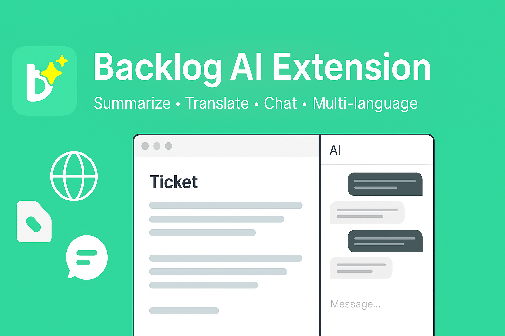
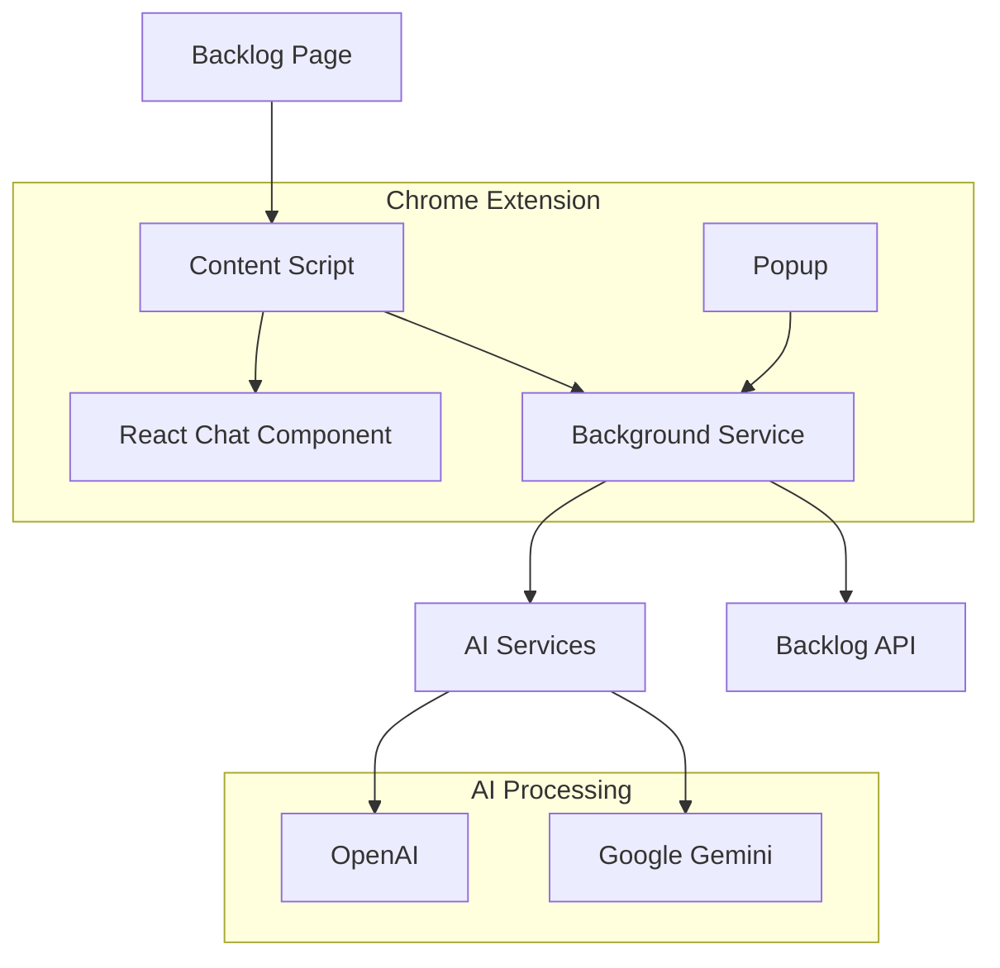

<div align="center">

<!-- Cover Image -->


# 🤖 Backlog AI Assistant

### Intelligent Chrome Extension for Backlog Project Management

[](https://chrome.google.com/webstore)
[](https://www.typescriptlang.org/)
[](https://reactjs.org/)
[](https://opensource.org/licenses/MIT)
[](https://github.com/your-repo/releases)

**Transform your Backlog workflow with AI-powered ticket analysis, smart suggestions, and intelligent chat assistance.**

[🚀 Installation](#installation) • [📖 Features](#features) • [⚙️ Configuration](#configuration) • [🛠️ Development](#development) • [🤝 Contributing](#contributing)

</div>

---

## ✨ Features

### 🎯 **Smart Ticket Analysis**
- **Automatic Analysis**: AI instantly analyzes ticket complexity, requirements, and technical scope
- **Risk Assessment**: Identifies potential challenges and blockers before they occur
- **Time Estimation**: Provides accurate effort estimates based on ticket content

### 💬 **Interactive AI Chat**
- **Contextual Conversations**: Chat directly about ticket details with full context awareness
- **Solution Suggestions**: Get technical recommendations and implementation approaches
- **Best Practices**: Receive industry-standard guidance and methodologies

### 🌍 **Multi-Language Support**
- **Vietnamese**: Native support with localized responses
- **English**: Professional technical communication
- **Japanese**: Full support for Japanese Backlog instances

### 🔒 **Enterprise-Grade Security**
- **Local Storage**: API keys stored securely in Chrome's encrypted storage
- **No Data Leakage**: Zero external data transmission except to authorized AI services
- **Privacy First**: Fully compliant with enterprise security standards

### ⚡ **Seamless Integration**
- **Universal Compatibility**: Works across all Backlog domains (`.com`, `.jp`, `.tool`)
- **Non-Intrusive**: Elegant sidebar interface that doesn't disrupt your workflow
- **Real-time Updates**: Instant analysis as you navigate between tickets

---

## 🚀 Installation

### 📦 Quick Install (Recommended)

1. **Download Latest Release**
   ```bash
   # Clone the repository
   git clone https://github.com/your-username/backlog-ai-ext.git
   cd backlog-ai-ext
   ```

2. **Install Dependencies**
   ```bash
   npm install
   ```

3. **Build Extension**
   ```bash
   # For development
   ./dev.sh build

   # For production
   npm run build
   ```

4. **Load in Chrome**
   - Open Chrome → `chrome://extensions/`
   - Enable **Developer mode** (top-right toggle)
   - Click **"Load unpacked"**
   - Select the `dev-build` folder (development) or `dist` folder (production)

### 🔧 Development Setup

```bash
# Start development with auto-reload
./dev.sh start

# Clean build artifacts
./dev.sh clean

# Check build status
./dev.sh status

# View help
./dev.sh help
```

---

## ⚙️ Configuration

### 🔑 **API Setup**

1. **Get Your API Keys**
   - **OpenAI**: Visit [OpenAI API Keys](https://platform.openai.com/api-keys)
   - **Google Gemini**: Visit [Google AI Studio](https://makersuite.google.com/app/apikey)

2. **Configure Extension**
   - Click the extension icon in Chrome toolbar
   - Select your preferred AI provider (OpenAI/Gemini)
   - Enter your API key
   - Test connection and save

3. **Backlog API (Optional)**
   - For enhanced features, configure Backlog API access
   - Supports multiple Backlog spaces
   - Enables real-time data synchronization

### 🎛️ **Customization Options**

| Setting | Options | Description |
|---------|---------|-------------|
| **AI Provider** | OpenAI, Google Gemini | Choose your preferred AI service |
| **Model** | GPT-3.5, GPT-4, Gemini Pro | Select AI model for analysis |
| **Language** | Vietnamese, English, Japanese | Interface and response language |
| **User Role** | Developer, PM, QA, Designer, DevOps | Customizes AI responses for your role |

---

## 🛠️ Development

### 📁 **Project Structure**

```
src/
├── 📂 content/              # Content scripts for Backlog pages
│   ├── content.ts           # Main content script
│   ├── ChatbotAsidePanel.tsx # React chat interface
│   └── sidebar.scss         # Styling for sidebar
├── 📂 background/           # Chrome extension background service
│   └── background.ts        # AI API handling & message routing
├── 📂 popup/               # Extension popup interface
│   ├── popup.tsx           # Settings and configuration UI
│   └── popup.scss          # Popup styling
├── 📂 shared/              # Shared utilities and types
│   ├── ticketAnalyzer.ts   # Ticket data extraction
│   ├── backlogApi.ts       # Backlog API integration
│   └── encryption.ts       # Secure API key storage
└── 📂 assets/              # Static resources
    └── icons/              # Extension icons
```

### 🔧 **Available Scripts**

| Command | Description |
|---------|-------------|
| `./dev.sh build` | Build for development with debugging |
| `./dev.sh start` | Start development with watch mode |
| `./dev.sh clean` | Clean build directories |
| `npm run build` | Production build (optimized) |
| `npm run lint` | TypeScript type checking |
| `npm test` | Run test suite |

### 🏗️ **Architecture Overview**



### 🔌 **Core Components**

- **Content Script**: Detects Backlog pages, extracts ticket data, manages UI injection
- **Background Service**: Handles AI API calls, manages settings, routes messages
- **React Components**: Interactive chat interface with real-time messaging
- **Popup Interface**: Configuration panel for API keys and preferences

---

## 🎯 Usage Guide

### 🚦 **Getting Started**

1. **Navigate to Backlog Ticket**
   - Open any ticket page in your Backlog workspace
   - The AI assistant will automatically activate

2. **Launch AI Assistant**
   - Click the floating 🤖 button (appears on ticket pages)
   - The intelligent sidebar will open on the right

3. **Start Chatting**
   - Use suggested prompts or ask custom questions
   - Get instant analysis and recommendations

### 💡 **Smart Suggestions**

| Button | Description | Example Response |
|--------|-------------|------------------|
| 📝 **Summarize** | Concise ticket overview | Key requirements, scope, and deliverables |
| 💡 **Explain** | Detailed technical analysis | Architecture decisions, implementation approach |
| 🌍 **Translate** | Multi-language support | Professional translation maintaining context |

### 🎪 **Pro Tips**

- **Ask Specific Questions**: "What's the estimated timeline for this feature?"
- **Request Code Reviews**: "Are there any security concerns with this approach?"
- **Seek Alternatives**: "What are other ways to implement this requirement?"
- **Get Best Practices**: "What testing strategy should we use?"

---

## 🔒 Security & Privacy

### 🛡️ **Security Features**

- **Encrypted Storage**: API keys encrypted using Chrome's secure storage APIs
- **Local Processing**: No sensitive data transmitted to unauthorized servers
- **HTTPS Only**: All communications use secure protocols
- **Sandbox Isolation**: Extension runs in isolated Chrome sandbox environment

### 🔐 **Privacy Commitment**

- ✅ **No Data Collection**: We don't collect or store user data
- ✅ **No Analytics**: No tracking or usage analytics
- ✅ **No Third-Party Sharing**: Data only shared with your chosen AI provider
- ✅ **Open Source**: Full transparency with open source code

---

## 🌐 **Supported Platforms**

### ✅ **Backlog Domains**
- `*.backlog.com` - International instances
- `*.backlog.jp` - Japanese instances
- `*.backlogtool.com` - Tool-specific instances

### 🤖 **AI Providers**
- **OpenAI** - GPT-3.5 Turbo, GPT-4, GPT-4 Turbo
- **Google Gemini** - Gemini Pro, Gemini Pro Vision

### 🌍 **Languages**
- **Vietnamese** (vi) - Native support
- **English** (en) - Full internationalization
- **Japanese** (ja) - Complete localization

---

## 🤝 Contributing

We welcome contributions from the community! Here's how you can help:

### 🚀 **Quick Start**

1. **Fork & Clone**
   ```bash
   git clone https://github.com/your-username/backlog-ai-ext.git
   cd backlog-ai-ext
   npm install
   ```

2. **Create Feature Branch**
   ```bash
   git checkout -b feature/amazing-feature
   ```

3. **Make Changes**
   - Follow TypeScript best practices
   - Add tests for new functionality
   - Update documentation as needed

4. **Test Thoroughly**
   ```bash
   npm run lint
   npm test
   ./dev.sh build
   ```

5. **Submit Pull Request**
   - Provide clear description of changes
   - Include screenshots for UI changes
   - Reference related issues

### 📋 **Contribution Guidelines**

- **Code Style**: Follow existing TypeScript/React patterns
- **Commits**: Use conventional commit format (`feat:`, `fix:`, `docs:`)
- **Testing**: Ensure all tests pass and add new tests for features
- **Documentation**: Update README and inline docs for changes

### 🐛 **Bug Reports**

Found a bug? Help us fix it:

1. **Check Existing Issues**: Search for existing reports
2. **Create Detailed Report**: Include steps to reproduce
3. **Provide Context**: Browser version, Backlog domain, error messages
4. **Screenshots**: Visual aids help tremendously

---

## 📊 **Roadmap**

### 🎯 **Upcoming Features**

- [ ] **Team Collaboration**: Multi-user chat sessions
- [ ] **Custom Templates**: Personalized analysis templates
- [ ] **Integration Hub**: Connect with Slack, Teams, Discord
- [ ] **Advanced Analytics**: Project insights and metrics
- [ ] **Mobile Support**: Progressive Web App version

### 🔄 **Recent Updates**

- ✅ **v1.0.0**: Initial release with core functionality
- ✅ **User Avatars**: Real Backlog user profile integration
- ✅ **Enhanced UI**: Professional sidebar design
- ✅ **Multi-AI Support**: OpenAI and Gemini integration

---

## 📄 **License**

This project is licensed under the **MIT License** - see the [LICENSE](LICENSE) file for details.

```
MIT License - Copyright (c) 2025 Backlog AI Assistant
Permission is hereby granted, free of charge, to any person obtaining a copy...
```

---

## 🙏 **Acknowledgments**

- **OpenAI** - For providing powerful GPT models
- **Google** - For Gemini AI capabilities
- **Nulab** - For creating the amazing Backlog platform
- **Chrome Extension Community** - For excellent documentation and examples
- **Contributors** - Everyone who helped make this project better

---

## 📞 **Support & Contact**

### 🆘 **Get Help**

- **GitHub Issues**: [Report bugs & request features](https://github.com/your-username/backlog-ai-ext/issues)
- **Documentation**: [Full documentation wiki](https://github.com/your-username/backlog-ai-ext/wiki)
- **Email**: [sontd.it@gmail.com](mailto:sontd.it@gmail.com)

### 💬 **Quick Support**

- **Bug Reports**: Use GitHub Issues for detailed bug reports
- **Feature Requests**: Submit enhancement ideas via GitHub Issues
- **General Questions**: Feel free to reach out via email for any questions
- **Contributions**: Check our [Contributing Guidelines](#contributing) to get started

---

<div align="center">

  **Made with ❤️ for the Backlog community**

  ⭐ **Star this repository if you find it helpful!** ⭐

  [🔝 Back to top](#-backlog-ai-assistant)

</div>
