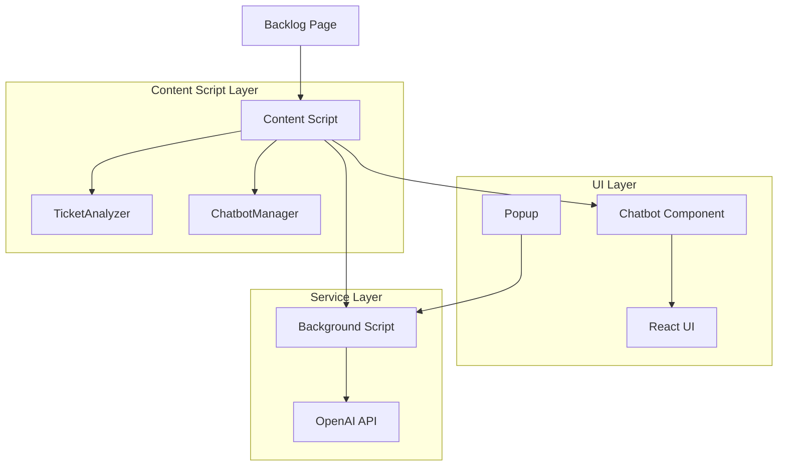

# Architecture Deep Dive

## Component Relationships



## Message Passing Flow

### 1. Ticket Analysis Flow
```javascript
// Content Script → Background
{
  action: 'analyzeTicket',
  data: {
    id: 'PROJ-123',
    title: 'Bug fix',
    description: '...',
    // ... other ticket data
  }
}

// Background → Content Script
{
  action: 'aiResponse',
  data: {
    response: 'AI analysis result...',
    type: 'analysis'
  }
}
```

### 2. Chat Message Flow
```javascript
// Chatbot → Content Script → Background
{
  action: 'processUserMessage',
  data: {
    sessionId: 'session_123',
    ticketId: 'PROJ-123',
    message: 'User question',
    conversationHistory: [...]
  }
}

// Background → Content Script → Chatbot
{
  action: 'aiResponse',
  data: {
    response: 'AI answer...',
    type: 'chat'
  }
}
```

### 3. Settings Management
```javascript
// Popup → Background
{
  action: 'saveApiKey',
  data: { apiKey: 'sk-...' }
}

// Popup → Background
{
  action: 'getApiKey'
}
```

## Data Structures

### TicketData Interface
```typescript
interface TicketData {
  id: string;           // PROJ-123
  title: string;        // Ticket title
  description: string;  // Main content
  status: string;       // Open, In Progress, etc.
  priority: string;     // High, Medium, Low
  assignee: string;     // Assigned person
  reporter: string;     // Person who created
  dueDate: string;      // Due date if any
  labels: string[];     // Tags/labels
  comments: CommentData[];
}

interface CommentData {
  author: string;
  content: string;
  timestamp: string;
}
```

### ChatMessage Interface
```typescript
interface ChatMessage {
  id: string;
  content: string;
  sender: 'user' | 'ai';
  timestamp: Date;
}

interface ChatSession {
  id: string;
  ticketId: string;
  messages: ChatMessage[];
  createdAt: Date;
}
```

## DOM Selectors Strategy

### Backlog Page Detection
```javascript
// URL patterns for ticket pages
const ticketPatterns = [
  /\/view\/[A-Z]+-\d+/,  // Standard format
  /\/view\//             // Fallback
];

// CSS selectors for ticket elements
const selectors = {
  title: [
    '.ticket__header-title',
    '.issue-title',
    '.ticket-title',
    'h1.title'
  ],
  description: [
    '.ticket__description',
    '.issue-description',
    '.ticket-description'
  ],
  status: [
    '.ticket__status',
    '.issue-status',
    '.status-value'
  ]
  // ... more selectors
};
```

## Error Handling Strategy

### 1. API Errors
```javascript
try {
  const response = await fetch(openaiUrl, {...});
  // Handle response
} catch (error) {
  console.error('API Error:', error);
  return `Lỗi khi gọi AI API: ${error}`;
}
```

### 2. DOM Extraction Errors
```javascript
private extractTicketData(): TicketData {
  try {
    return {
      id: this.extractTicketId(),
      title: this.extractTitle(),
      // ... other fields
    };
  } catch (error) {
    console.error('Error extracting ticket:', error);
    return defaultTicketData;
  }
}
```

### 3. Communication Errors
```javascript
chrome.runtime.onMessage.addListener((message, sender, sendResponse) => {
  try {
    this.handleMessage(message, sender, sendResponse);
  } catch (error) {
    console.error('Message handling error:', error);
    sendResponse({ error: String(error) });
  }
});
```

## Performance Considerations

### 1. Lazy Loading
- React components loaded only when needed
- Chatbot script injected dynamically
- CSS loaded on demand

### 2. Caching
- Ticket data cached in background script
- Chat sessions stored locally
- API responses cached temporarily

### 3. Throttling
- Debounced user input
- Rate-limited API calls
- Optimized DOM queries

## Security Implementation

### 1. Content Security Policy
```json
{
  "content_security_policy": {
    "extension_pages": "script-src 'self'; object-src 'self'"
  }
}
```

### 2. API Key Security
```javascript
// Secure storage
chrome.storage.sync.set({ openaiApiKey: apiKey });

// Never expose in content scripts
// Always proxy through background script
```

### 3. Input Sanitization
```javascript
// Sanitize user inputs before API calls
const sanitizedMessage = message.trim().slice(0, 2000);
```

## Extension Lifecycle

### 1. Installation
- Manifest validation
- Permission grants
- Initial setup

### 2. Page Load
- Content script injection
- DOM ready detection
- Component initialization

### 3. User Interaction
- Button clicks
- Message sending
- Settings changes

### 4. Background Processing
- API calls
- Data persistence
- Message routing

### 5. Cleanup
- Event listener removal
- Memory cleanup
- Storage optimization
